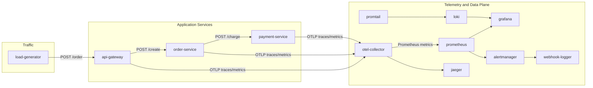

# AIOps Lab

AIOps Lab is a Docker Compose demo for application observability across traces, metrics, logs, dashboards, and alerting.

The core request path is:

`load-generator -> api-gateway -> order-service -> payment-service`

Each service emits OpenTelemetry traces and metrics. Logs are shipped with Promtail to Loki, Prometheus scrapes the OpenTelemetry Collector, Grafana reads from Prometheus and Loki, and Alertmanager is wired into Prometheus alerting.

## What's Included

- Three Node.js services: `api-gateway`, `order-service`, and `payment-service`
- An OpenTelemetry Collector for traces and metrics
- Prometheus for metrics scraping and alerting
- Grafana dashboards and data sources
- Loki and Promtail for logs
- Alertmanager for alerts
- Jaeger for trace visualization
- A webhook logger for alert delivery demos
- A built-in load generator that drives the demo automatically

## Architecture

The system is designed as a small distributed application with an observability stack wrapped around it.

- `load-generator` creates a steady stream of traffic and short bursts for spike testing
- `api-gateway` receives requests and forwards them to `order-service`
- `order-service` simulates business processing and calls `payment-service`
- `payment-service` simulates payment handling and intermittent failures
- `otel-collector` receives telemetry from the services and exports metrics for Prometheus
- `prometheus` scrapes the collector and evaluates alert rules
- `grafana` visualizes metrics and logs
- `loki` stores logs shipped by `promtail`
- `alertmanager` receives alerts from Prometheus and routes them to the configured receiver
- `jaeger` provides trace visibility for the full request chain

This layout is useful for practicing incident response because failures can be introduced at different layers while still keeping the data flow understandable.

## Project Structure

```text
.
|-- api-gateway/
|   |-- index.js
|   |-- Dockerfile
|   |-- package.json
|   `-- tracing.js
|-- order-service/
|   |-- index.js
|   |-- Dockerfile
|   |-- package.json
|   `-- tracing.js
|-- payment-service/
|   |-- index.js
|   |-- Dockerfile
|   |-- package.json
|   `-- tracing.js
|-- otel-collector/
|   `-- otelcol-config.yml
|-- prometheus/
|   |-- prometheus.yml
|   `-- alert-rules.yml
|-- grafana/
|   `-- provisioning/
|-- alertmanager/
|   |-- alertmanager.yml
|   `-- start.sh
|-- promtail/
|   `-- promtail-config.yml
|-- webhook-logger/
|   |-- server.js
|   `-- Dockerfile
|-- load-generator.js
`-- docker-compose.yml
```

## Tools

| Tool | Purpose |
| --- | --- |
| Docker Compose | Starts the full lab with one command |
| Node.js | Runs the three application services and the load generator |
| OpenTelemetry SDK | Creates traces and metrics in each service |
| OpenTelemetry Collector | Receives OTLP telemetry and exposes Prometheus metrics |
| Prometheus | Scrapes telemetry metrics and evaluates alert rules |
| Grafana | Displays dashboards for metrics and logs |
| Loki | Stores container logs |
| Promtail | Ships Docker logs into Loki |
| Alertmanager | Handles alert delivery and routing |
| Jaeger | Lets you inspect distributed traces |
| webhook-logger | Receives demo alert webhooks for validation |

## Incident Scenarios

The demo is intended to help test common observability and incident-response cases:

1. `payment-service` failures: Simulates a payment decline roughly 15% of the time, which is useful for checking error traces, failed request counts, and alert visibility.
2. Latency spikes in the request chain: Each service adds a small processing delay, which helps validate trace timing, service-to-service breakdowns, and slow request detection.
3. Collector or telemetry disruption: If the OpenTelemetry Collector is unavailable, metrics and traces stop flowing, which helps verify that missing telemetry is visible in dashboards and logs.
4. Prometheus scrape or alerting issues: If scraping fails, dashboards and alert rules go stale, which is useful for checking whether alerting and data freshness are being monitored.
5. Log pipeline failures: If Promtail or Loki is unavailable, logs stop appearing in Grafana, which helps validate log-loss detection and troubleshooting workflows.
6. Traffic surge from the load generator: The built-in burst helps simulate sudden load increases, which is useful for observing spikes in latency, error rates, and service saturation.

## Full Pipeline Diagram



## Quick Start

1. Start everything from the project root:

```bash
docker compose up --build -d
```

2. Wait for the services to finish booting. The load generator starts automatically and begins sending traffic after startup.

3. Verify the application is healthy:

```bash
curl http://localhost:3000/health
curl http://localhost:3001/health
curl http://localhost:3002/health
```

4. Generate a manual request if you want to test the full chain yourself:

```bash
curl -X POST http://localhost:3000/order \
  -H "Content-Type: application/json" \
  -d '{"item":"laptop","quantity":2,"userId":"user-001"}'
```

## Service Map

| Service | Purpose | Port(s) | Notes |
| --- | --- | --- | --- |
| `api-gateway` | Accepts order requests and forwards them to the order service | `3000` | Exposes `POST /order` and `GET /health` |
| `order-service` | Processes orders and calls the payment service | `3001` | Exposes `POST /create` and `GET /health` |
| `payment-service` | Simulates payment charging with a failure rate | `3002` | Exposes `POST /charge` and `GET /health` |
| `otel-collector` | Receives OTLP telemetry and exposes Prometheus metrics | `4317`, `4318`, `8889` | Prometheus scrapes `otel-collector:8889` |
| `prometheus` | Scrapes the collector and evaluates alert rules | `9090` | Alertmanager is configured as the alert target |
| `grafana` | Visualization UI | `3030` | Anonymous access is enabled |
| `loki` | Log storage | `3100` | Used by Grafana and Promtail |
| `promtail` | Ships container logs to Loki | `9080` | Internal service port only |
| `alertmanager` | Receives alerts from Prometheus | `9093` | Uses config from `alertmanager/alertmanager.yml` |
| `webhook-logger` | Receives webhook notifications for demo alerts | `5001` | Useful for verifying alert delivery |
| `jaeger` | Trace UI | `16686` | Collector endpoint exposed on `14250` |
| `load-generator` | Sends traffic into the gateway | none | Runs inside the Compose network |

## Useful URLs

- API Gateway: `http://localhost:3000`
- API Gateway health: `http://localhost:3000/health`
- Order Service health: `http://localhost:3001/health`
- Payment Service health: `http://localhost:3002/health`
- Prometheus: `http://localhost:9090`
- Grafana: `http://localhost:3030`
- Loki: `http://localhost:3100`
- Alertmanager: `http://localhost:9093`
- Jaeger: `http://localhost:16686`
- Webhook logger: `http://localhost:5001`
- Collector metrics: `http://localhost:8889/metrics`

## Request Flow

1. The load generator sends a request to `POST /order` every 2 seconds.
2. After a 5 second warm-up, it sends a burst of 10 extra requests.
3. The API gateway forwards the request to `order-service`.
4. The order service simulates processing, then calls `payment-service`.
5. The payment service simulates latency and returns either success or a failure.
6. Telemetry is exported to the collector and becomes visible in Prometheus, Grafana, and Jaeger.

## Observability Data Flow

- Traces and metrics are exported from the services to the OpenTelemetry Collector over OTLP gRPC on `4317`
- The collector exposes Prometheus-format metrics on `8889`
- Prometheus scrapes `otel-collector:8889` every 10 seconds
- Grafana uses Prometheus as its default metrics data source
- Grafana also has Loki configured for log exploration
- Promtail forwards Docker container logs to Loki

## Expected Behavior

When the stack is healthy and traffic is flowing, you should see:

- `docker compose ps` shows the core services running
- `curl http://localhost:3000/health` returns a healthy JSON response
- `http://localhost:8889/metrics` includes metrics after traffic starts
- Grafana shows service metrics and logs
- Jaeger shows spans for the request chain

## Troubleshooting

### `/metrics` looks empty

- Make sure the load generator is running
- Send a manual request to `POST /order`
- Check that `otel-collector` is healthy and not restarting

### Grafana dashboards are empty

- Verify Prometheus is available at `http://localhost:9090`
- Confirm the collector is being scraped at `otel-collector:8889`
- Check that the services are actually receiving requests

### Logs do not appear in Loki

- Confirm Promtail is running
- Check that Docker socket access is available inside the Promtail container
- Verify the Grafana Loki data source is enabled

### Services cannot reach each other

- `api-gateway` calls `order-service:3001`
- `order-service` calls `payment-service:3002`
- All services should be on the same Docker Compose network

### View logs

```bash
docker compose logs --tail=50 otel-collector
docker compose logs --tail=50 api-gateway
docker compose logs --tail=50 order-service
docker compose logs --tail=50 payment-service
docker compose logs --tail=50 prometheus
docker compose logs --tail=50 grafana
```

## Notes

- `payment-service` simulates roughly a 15% failure rate
- The demo is meant for local observability practice, not production use
- If you change any service code or configuration, rebuild the stack with `docker compose up --build`
